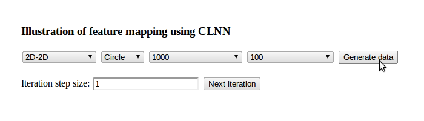
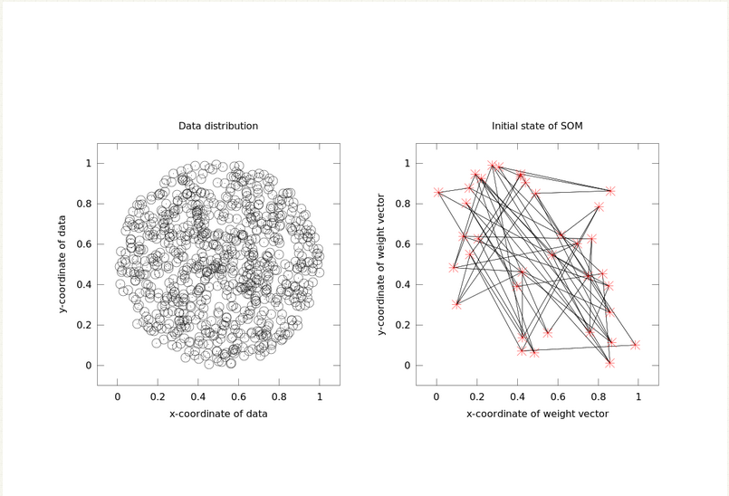
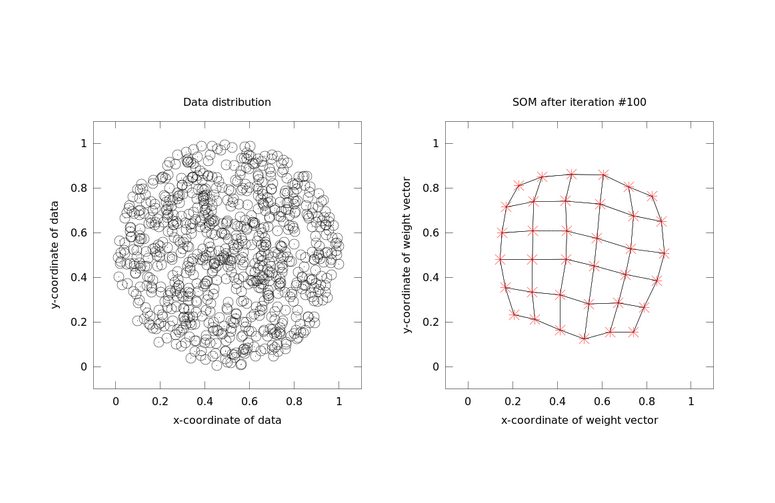

### CLNN for feature mapping

We can use this experiment to understand the application of competitive learning neural networks in mapping a given pattern of data points. Here we first use the experiment to generate a set of random data points following a definite pattern. For this we have the option to choose between the number of points and the type of pattern that can be generated.

**Figure 1**: *Illustration of the initial user inputs.*

We can choose the iteration step size, which later generates a number of nodes (typically more than twice the number of data points choosen). These nodes generated would be randomly distributed across the available space.

**Figure 2**: *Illustration of the initial state of SOM.*

After going through a number of iterations, we finally notice that the nodes in the network settle in such a way that the network tries to capture the distribution of the pattern generated from the data points.

**Figure 3**: *Illustration of the state of SOM after 20 iterations.*

**Figure 4**: *Illustration of the state of SOM after 100 iterations.*